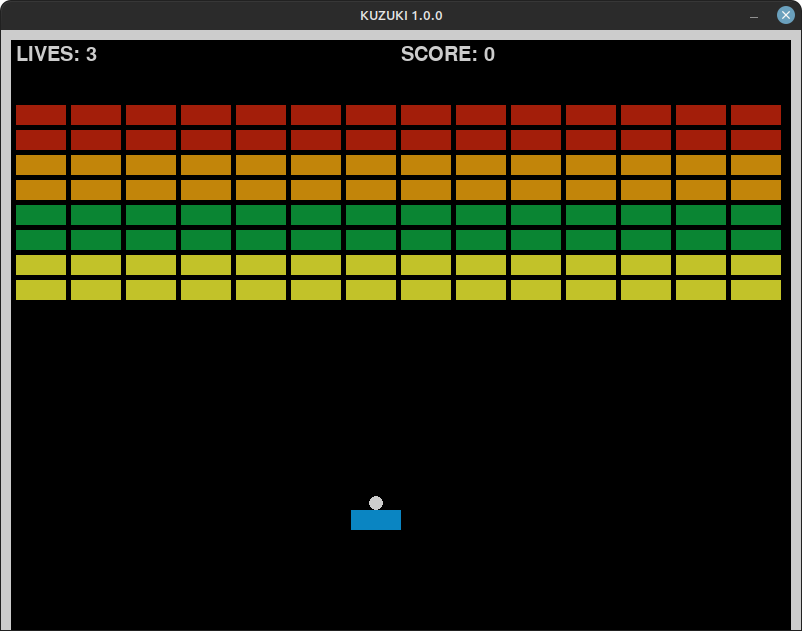

# Kuzuki - A Breakout Clone with PyGame



## Getting Started

```shell
$ pip3 install -r requirements.txt
...
$ python3 -m src.kuzuki  # running it as a MODULE NOT AS A SCRIPT
```

OR

```shell
$ bash start.sh  # this assumes you have a virtual env named .venv + pygame installed in it
```

## References

- Breakout: https://en.wikipedia.org/wiki/Breakout_(video_game)
- PyGame Docs: https://www.pygame.org/docs/
- Stackoverflow: https://stackoverflow.com/
